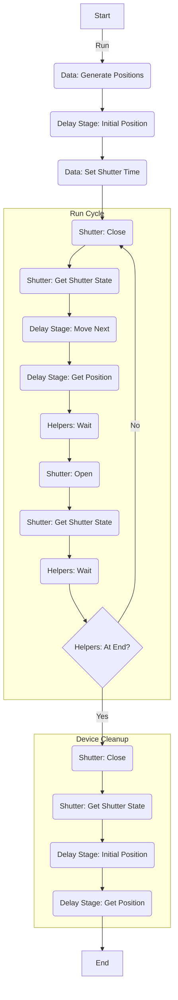

# Delay-Shutter-Sync
 

```mermaid
graph
S[Start] 
--> |Run|D:GP(Data: Generate Positions)
--> DS:IP(Delay Stage: Initial Position)
--> D:ST(Data: Set Shutter Time)
--> S:C(Shutter: Close)
--> S:GST(Shutter: Get Shutter State)
--> DS:MN(Delay Stage: Move Next)
--> DS:GP(Delay Stage: Get Position)
--> H:W(Helpers: Wait)
--> S:O(Shutter: Open)
--> S:GST2(Shutter: Get Shutter State) 
--> H:W2(Helpers: Wait)
--> H:E?{Helpers: At End?}
H:E? --> |Yes| S:C2(Shutter: Close)
H:E? --> |No| S:C
S:C2 --> S:GST3(Shutter: Get Shutter State)
--> DS:IP2(Delay Stage: Initial Position)
--> DS:GP2(Delay Stage: Get Position)
--> E[End];

subgraph Run Cycle
    S:C
    S:GST
    DS:MN
    DS:GP
    H:W
    S:O
    S:GST2
    H:W2
    H:E?
end

subgraph Device Cleanup
S:C2
S:GST3
DS:IP2
DS:GP2
end
```